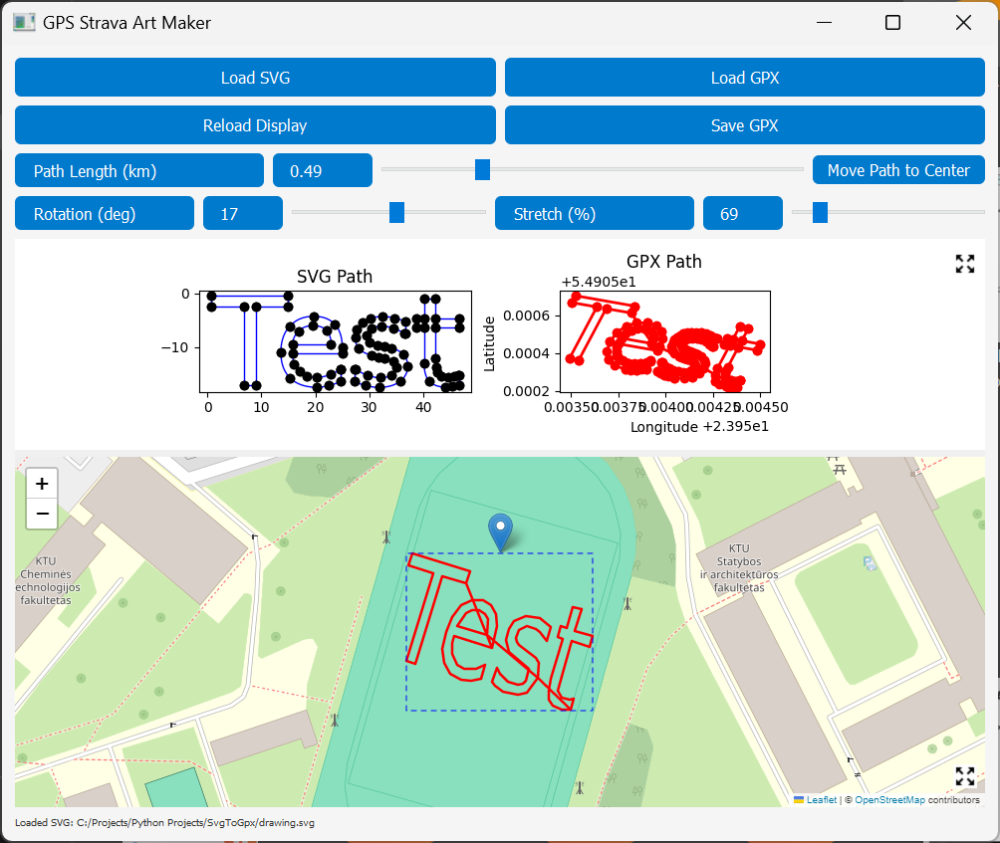

# GPS STRAVA ART MAKER


## How to run
Open powershell and run these commands
```
cd C:\<PATH_TO_FOLDER>
python -m pip install -r .\requirements.txt  # Installs dependencies. Should be run only once
python ./gps_strava_art_maker.py  # Starts the main program
```
Note: If bottom pane is white wait until maps are loaded  


# Workflow
1. Create SVG image with Inkscape or any other program.
   - SVG should contain `only Path elements`
   - SVG can contain multiple paths which will be automatically connected into a single path
   - Tool that draw paths: Pen Tool, Pencil Tool, Rectangle Tool etc.
   - Text can also be used by [converting it to paths](https://imagy.app/inkscape-text-to-path/).
      - Type the text using the Text Tool (T)
      - Select the text using the Select and Transform Objects Tool (S)
      - Convert the text with `Path → Object to Path`
      - Edit the path nodes as needed
2. After creating image and converting it to paths crop white space
    - `Edit → Resize Page to Selection` or just `Ctrl+Shift+R`
3. Save the file as .svg `File → Save As`
4. Open powershell in script folder and start the script (assuming pip install is done) 
   1. `cd C:\<PATH_TO_FOLDER>`
   2. `python ./gps_strava_art_maker.py`
5. Press `Load SVG` (or `Load GPX`)
6. You can see loaded file at the top pane and GPX path on bottom pane map
7. Panes can be resized by hand or by pressing expand icon in the right corner of the panes
8. Set `Path length` to resize. This parameter show final path length in kilometers
9. Set `Rotation`
10. Set `Stretch` to change image ratio
11. To relocate path path drag the blue handle on the map or move the map and press `Move Path to Center`
12. Save `Save GPX`
13. To check any GPX file you can either use `Load GPX` or use [gpx.studio/app](www.gpx.studio/app)
14. Upload GPX file to your device for navigation: GPX Viewer, Komoot, Garmin, Strava
15. Check if programs open gpx file correctly (some app like to follow existing paths, roads instead of given gpx)
16. Go outside and complete the path!

## Sample files
- [drawing_test.svg](./drawing_test.svg)
- [drawing_test.gpx](./drawing_test.gpx)
